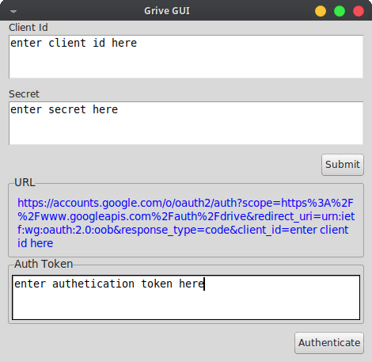

##  GriveGUI

**Home Screen**


**Authentication Screen**



 


## For OAuth Generation

ReadMe: [Check](https://github.com/Dishendramishra/linux-setup#google-drive)

or

Video  

[](https://www.youtube.com/watch?v=TzO8FyGu4U0)


## Installation

#### :pushpin: **Dependencies:**

- grive2: https://github.com/vitalif/grive2

  

  #### Installing GriveGUI

  Download from [Releases](https://github.com/Dishendramishra/grive-gui/releases) 

```she
sudo tar -xvf grivegui.tar.gz --directory /usr/local/bin
sudo mv /usr/local/bin/grivegui.desktop /usr/share/applications/
sudo mv /usr/local/bin/grivegui_icon.png /usr/share/icons/

```


## Uninstall

```she
sudo rm -rf /usr/local/bin/grivegui 
sudo rm -rf /usr/share/applications/grivegui.desktop
sudo rm -rf /usr/share/icons/grivegui_icon.png

```

